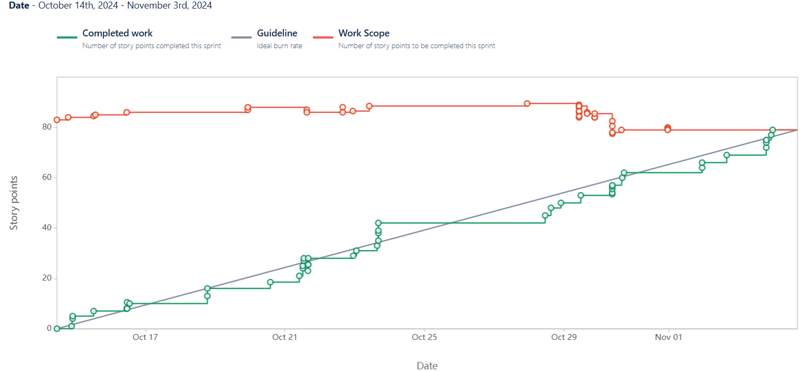
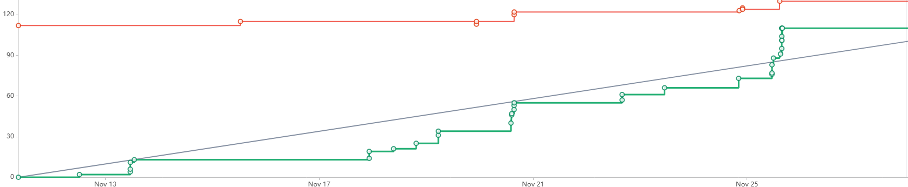

# DANDDY 
> A D&D campaign helper.

## Table of Contents
* [Description](#description)
* [GeneralInformation](#general-information)
* [TechnologiesUsed](#technologies-used)
* [Features](#features)
* [Contact](#contact)

<!-- * [License](#license) -->

## Description
- Collaborators : [Contact](#contact)
- Creating a D&D Campaign helper that improves quality of life for campaigns and combat  
- Improve the quality of life and gameflow of DM's and players.
- We are doing this to save some time for players and improve the QoL for players

## General Information 

## Collaborated On
- [Jira](https://cs3398-luna-fall24.atlassian.net/jira/software/projects/SCRUM/boards/1)

## Technologies Used
- [React](https://react.dev/)
- [Type-Script](https://www.typescriptlang.org/)
- [Cloud Tunnel](https://www.cloudflare.com/products/tunnel/)

## Features
- Device Connectivity:
   - Users should be able to connect to each others device to give an update about combat and etc..  
   - The DM and the players are going to be connected to show the game
- DM Interface
   - DM has a list of players info and character sheets  
   - edit and take notes
- Player Interface
   - Toggle dice roller. Have their own character sheets and status.
   - Players should have their own screen

## Sprint 1

#### Contributions

**Adam**: "Developed a public messaging system and reasearched the best fitting database"  
   >- `Jira Task: Implement UI for Combat Order` 
      - [CP-26](https://cs3398-luna-f24.atlassian.net/browse/CP-26?atlOrigin=eyJpIjoiNzQxNTI2YTZkOTQ3NGE1NDhmODIxYzdjZjc4NDlmMTciLCJwIjoiaiJ9), [Bitbucket Branch](https://bitbucket.org/cs3398-luna-f24/danddy_cs3398project/branch/CP-24-design--implement-ui-for-combat-pa)  
   - `Jira Task: Research AppwWrite BaaS`  
      - [CP-74](https://cs3398-luna-f24.atlassian.net/browse/CP-74), [Bitbucket Branch](https://bitbucket.org/cs3398-luna-f24/danddy_cs3398project/branch/CP-74-research-appwwrite-baas)  
   - `Jira Task: Implement Google Firebase`  
      - [CP-81](https://cs3398-luna-f24.atlassian.net/browse/CP-81), [Bitbucket Branch]()  
   - `Jira Task: Implement DM to Player messaging system`
      - [CP-46](https://cs3398-luna-f24.atlassian.net/browse/CP-46), [Bitbucket Branch](https://bitbucket.org/cs3398-luna-f24/danddy_cs3398project/branch/CP-46-implement-dm-to-player-messaging-system)  

**Joshua**: "Created the database connection, as well as the lobby joining process."  
   >- `Jira Task: Create Room System for Players and DM`  
      - [CP-83](https://cs3398-luna-f24.atlassian.net/browse/CP-83), [Bitbucket Branch](https://bitbucket.org/cs3398-luna-f24/danddy_cs3398project/branch/CP-83-create-room-system-for-players-and)  
   - `Jira Task: Create base project file structure using Next.js`  
      - [CP-75](https://cs3398-luna-f24.atlassian.net/browse/CP-75), [Bitbucket Branch](https://bitbucket.org/cs3398-luna-f24/danddy_cs3398project/branch/CP-75-create-base-project-file-structure)  
   - `Jira Task: Database Schema Design for Combat Tracking`  
      - [CP-27](https://cs3398-luna-f24.atlassian.net/browse/CP-45), [Bitbucket Branch](https://bitbucket.org/cs3398-luna-f24/danddy_cs3398project/branch/CP-27-database-schema-design-for-combat-)  
   - `Jira Task: Investigate DND API`  
      - [CP-44](https://cs3398-luna-f24.atlassian.net/browse/CP-27), [Bitbucket Branch](https://bitbucket.org/cs3398-luna-f24/danddy_cs3398project/branch/CP-44-investigate-dnd-api)  
   - `Jira Task: Build local multiplayer integration` 
      - [CP-5](https://cs3398-luna-f24.atlassian.net/browse/CP-5), [Bitbucket Branch](https://bitbucket.org/cs3398-luna-f24/danddy_cs3398project/branch/CP-5-build-local-multiplayer-integration)  

**Olivia**: ""  
   >- `Jira Task: Implement Player UI`  
      - [CP-82](https://cs3398-luna-f24.atlassian.net/browse/CP-82), [Bitbucket Branch](https://bitbucket.org/cs3398-luna-f24/danddy_cs3398project/branch/CP-82-implement-player-ui)  
   - `Jira Task: Implement DM interface`  
      - [CP-77](https://cs3398-luna-f24.atlassian.net/browse/CP-77), [Bitbucket Branch](https://bitbucket.org/cs3398-luna-f24/danddy_cs3398project/branch/CP-77-implement-dm-interface)  
   - `Jira Task: Design/ Implement UI for Combat Page`  
      - [CP-24](https://cs3398-luna-f24.atlassian.net/browse/CP-24), [Bitbucket Branch](https://bitbucket.org/cs3398-luna-f24/danddy_cs3398project/branch/CP-24-design--implement-ui-for-combat-pa)  
   - `Jira Task:  Design Player Management UI`  
      - [CP-18](https://cs3398-luna-f24.atlassian.net/browse/CP-18), [Bitbucket Branch](https://bitbucket.org/cs3398-luna-f24/danddy_cs3398project/branch/CP-18-design-player-ui)  
   - `Jira Task: Creating Components for DM Home and Character Sheets`  
      - [CP-8](https://cs3398-luna-f24.atlassian.net/browse/CP-8), [Bitbucket Branch](https://bitbucket.org/cs3398-luna-f24/danddy_cs3398project/branch/CP-8-implement-dm-pages-charsheets-npc-e)  
   - `Jira Task: Design DM interface`  
      - [CP-7](https://cs3398-luna-f24.atlassian.net/browse/CP-7), [Bitbucket Branch](https://bitbucket.org/cs3398-luna-f24/danddy_cs3398project/branch/CP-7-design-dm-interface)  

**Roman**: "Designed and integrated database and authentication through Firebase"  
   >- `Jira Task: Design Database Schema`  
      - [CP-36](https://cs3398-luna-f24.atlassian.net/browse/CP-36), [Bitbucket Branch](https://bitbucket.org/cs3398-luna-f24/danddy_cs3398project/branch/CP-36-design-database-schema)  
   - `Jira Task: Implement Initial Structure of the Database`  
      - [CP-78](https://cs3398-luna-f24.atlassian.net/browse/CP-78), [Bitbucket Branch](https://bitbucket.org/cs3398-luna-f24/danddy_cs3398project/branch/feature/CP-78-implement-initial-structure-of-the)  
   - `Jira Task: Implement Authentication for User Data Secuirty`  
      - [CP-39](https://cs3398-luna-f24.atlassian.net/browse/CP-39), [Bitbucket Branch](https://bitbucket.org/cs3398-luna-f24/danddy_cs3398project/branch/CP-39-implement-authentication)  
   - `Jira Task: Implement Backend API to Connect to Cloud Database`  
      - [CP-37](https://cs3398-luna-f24.atlassian.net/browse/CP-37), [Bitbucket Branch](https://bitbucket.org/cs3398-luna-f24/danddy_cs3398project/branch/CP-37-implement-backend-api)  

**Lorenz**: "Designed,implemented and integrated Homescreen,Character Page, and Login Page (Front-end)"  
   >- `Jira Task: Design home screen`  
      - [CP-3](https://cs3398-luna-f24.atlassian.net/browse/CP-3)  
      - [Bitbucket Branch](https://bitbucket.org/cs3398-luna-f24/danddy_cs3398project/branch/CP-3-design-home-screen)  
   - `Jira Task: Track Player data in database`  
      - [CP-43](https://cs3398-luna-f24.atlassian.net/browse/CP-43)  
      - [Bitbucket Branch](https://bitbucket.org/cs3398-luna-f24/danddy_cs3398project/branch/CP-43-track-player-data-in-database)  
   - `Jira Task: Use 5ednd API to create a test and mockup for the API`  
      - [CP-51](https://cs3398-luna-f24.atlassian.net/browse/CP-51)  
      - [Bitbucket Branch](https://bitbucket.org/cs3398-luna-f24/danddy_cs3398project/branch/CP-51-use-an-api-that-has-dd-related-con)  
   - `Jira Task: Implement Player List Component`  
      - [CP-19](https://cs3398-luna-f24.atlassian.net/browse/CP-19)  
      - [Bitbucket Branch](https://bitbucket.org/cs3398-luna-f24/danddy_cs3398project/branch/CP-19-implement-player-list-component)  
   - `Jira Task: Implement Home screen design`  
      - [CP-76](https://cs3398-luna-f24.atlassian.net/browse/CP-76)  
      - [Bitbucket Branch](https://bitbucket.org/cs3398-luna-f24/danddy_cs3398project/branch/CP-76-implement-home-screen-design)  

### Reports

## Sprint 2

#### Contributions

**Adam**: "Implemented a private messaging system UI, a cleaner authentication frontend, and researched user messaging backend"  
- `Jira Task: Implement a shadCn Forms component` 
    - [SCRUM-107](https://cs3398-luna-fall24.atlassian.net/browse/SCRUM-107), [Bitbucket Branch](https://bitbucket.org/cs3398-luna-f24/%7B7ebd87c8-49ae-4c7a-9442-fc3ca9fa4d1c%7D/branch/SCRUM-107-implement-a-shadcn-forms-compo)  
- `Jira Task: Implement SignUp UI`  
    - [SCRUM-106](https://cs3398-luna-fall24.atlassian.net/browse/SCRUM-106), [Bitbucket Branch](https://bitbucket.org/cs3398-luna-f24/%7B7ebd87c8-49ae-4c7a-9442-fc3ca9fa4d1c%7D/branch/SCRUM-106_2-implement-sign-up-ui)  
- `Jira Task: Implement SignIn UI`  
    - [SCRUM-105](https://cs3398-luna-fall24.atlassian.net/browse/SCRUM-105), [Bitbucket Branch](https://bitbucket.org/cs3398-luna-f24/%7B7ebd87c8-49ae-4c7a-9442-fc3ca9fa4d1c%7D/branch/SCRUM-105_2-implement-signin-ui)  
- `Jira Task: Redirect unauthorized users to the SignIn page`  
    - [SCRUM-109](https://cs3398-luna-fall24.atlassian.net/browse/SCRUM-109), [Bitbucket Branch](https://bitbucket.org/cs3398-luna-f24/%7B7ebd87c8-49ae-4c7a-9442-fc3ca9fa4d1c%7D/branch/SCRUM-109-redirect-unauthorized-users)  
- `Jira Task: Design the Message System UI`  
    - [SCRUM-31](https://cs3398-luna-fall24.atlassian.net/browse/SCRUM-31), [Bitbucket Branch](https://bitbucket.org/cs3398-luna-f24/%7B7ebd87c8-49ae-4c7a-9442-fc3ca9fa4d1c%7D/branch/SCRUM-31-design-the-message-system-ui)  
- `Jira Task: Implement chat button on DM homepage`  
    - [SCRUM-112](https://cs3398-luna-fall24.atlassian.net/browse/SCRUM-112), [Bitbucket Branch](https://bitbucket.org/cs3398-luna-f24/%7B7ebd87c8-49ae-4c7a-9442-fc3ca9fa4d1c%7D/branch/SCRUM-112-implement-chat-button-on-dm-ho)  
- `Jira Task: Implement chat button on Player homepage`  
    - [SCRUM-111](https://cs3398-luna-fall24.atlassian.net/browse/SCRUM-111), [Bitbucket Branch](https://bitbucket.org/cs3398-luna-f24/%7B7ebd87c8-49ae-4c7a-9442-fc3ca9fa4d1c%7D/branch/SCRUM-111-implement-chat-button-on-playe)  
- `Jira Task: Implement shadCn derived drawer component`  
    - [SCRUM-113](https://cs3398-luna-fall24.atlassian.net/browse/SCRUM-113), [Bitbucket Branch](https://bitbucket.org/cs3398-luna-f24/%7B7ebd87c8-49ae-4c7a-9442-fc3ca9fa4d1c%7D/branch/SCRUM-113-implement-shadcn-derived-drawe)  
- `Jira Task: Implement messaging design UI`  
    - [SCRUM-157](https://cs3398-luna-fall24.atlassian.net/browse/SCRUM-157), [Bitbucket Branch](https://bitbucket.org/cs3398-luna-f24/%7B7ebd87c8-49ae-4c7a-9442-fc3ca9fa4d1c%7D/branch/SCRUM-157-implement-messaging-design-ui)  
- `Jira Task: Research auth respective messaging`  
    - [SCRUM-114](https://cs3398-luna-fall24.atlassian.net/browse/SCRUM-114), [Bitbucket Branch](https://bitbucket.org/cs3398-luna-f24/%7B7ebd87c8-49ae-4c7a-9442-fc3ca9fa4d1c%7D/branch/SCRUM-114-research-auth-respective-messa)  

**Joshua**: "Psst. Hey. Summarize what you did."  
-  `Jira Task: Sync Character Stats from backend`  
    - [SCRUM-129](https://cs3398-luna-fall24.atlassian.net/browse/SCRUM-129), [Bitbucket Branch](https://bitbucket.org/cs3398-luna-f24/%7B7ebd87c8-49ae-4c7a-9442-fc3ca9fa4d1c%7D/branch/SCRUM-129-sync-character-stats-from-back)  
- `Jira Task: Create basic dice roller pop up`  
    - [SCRUM-155](https://cs3398-luna-fall24.atlassian.net/browse/SCRUM-155), [Bitbucket Branch](https://bitbucket.org/cs3398-luna-f24/%7B7ebd87c8-49ae-4c7a-9442-fc3ca9fa4d1c%7D/branch/SCRUM-155-create-basic-dice-roller-pop-u)  
- `Jira Task: Create Enemy Template Creation Screen`  
    - [SCRUM-158](https://cs3398-luna-fall24.atlassian.net/browse/SCRUM-158), [Bitbucket Branch](https://bitbucket.org/cs3398-luna-f24/%7B7ebd87c8-49ae-4c7a-9442-fc3ca9fa4d1c%7D/branch/SCRUM-158-create-enemy-template-creation)  
- `Jira Task: Create character creation UI`  
    - [SCRUM-132](https://cs3398-luna-fall24.atlassian.net/browse/SCRUM-132), [Bitbucket Branch](https://bitbucket.org/cs3398-luna-f24/%7B7ebd87c8-49ae-4c7a-9442-fc3ca9fa4d1c%7D/branch/SCRUM-132-create-character-creation-ui)  
- `Jira Task: Create character creation logic`  
    - [SCRUM-131](https://cs3398-luna-fall24.atlassian.net/browse/SCRUM-131), [Bitbucket Branch](https://bitbucket.org/cs3398-luna-f24/%7B7ebd87c8-49ae-4c7a-9442-fc3ca9fa4d1c%7D/branch/SCRUM-131-create-character-creation-logi)  
- `Jira Task: Adding DM edit stats of enemy templates`  
    - [SCRUM-160](https://cs3398-luna-fall24.atlassian.net/browse/SCRUM-160), [Bitbucket Branch](https://bitbucket.org/cs3398-luna-f24/%7B7ebd87c8-49ae-4c7a-9442-fc3ca9fa4d1c%7D/branch/SCRUM-160-adding-dm-edit-stats-of-enemy-)  

**Olivia**: "Psst. Hey. Summarize what you did."  
- `Jira Task: Create overall color scheme and design`  
    - [SCRUM-121](https://cs3398-luna-fall24.atlassian.net/browse/SCRUM-121), [Bitbucket Branch](https://bitbucket.org/cs3398-luna-f24/%7B7ebd87c8-49ae-4c7a-9442-fc3ca9fa4d1c%7D/branch/SCRUM-121-create-overall-color-scheme-an)  
- `Jira Task: Add in functional features/buttons for Player`  
    - [SCRUM-119](https://cs3398-luna-fall24.atlassian.net/browse/SCRUM-119), [Bitbucket Branch](https://bitbucket.org/cs3398-luna-f24/%7B7ebd87c8-49ae-4c7a-9442-fc3ca9fa4d1c%7D/branch/SCRUM-119-add-in-functional-features-but)  
- `Jira Task: Redesign the Player Interface`  
    - [SCRUM-117](https://cs3398-luna-fall24.atlassian.net/browse/SCRUM-117), [Bitbucket Branch](https://bitbucket.org/cs3398-luna-f24/%7B7ebd87c8-49ae-4c7a-9442-fc3ca9fa4d1c%7D/branch/SCRUM-117-redesign-the-dm-player-interfa)  
- `Jira Task: Add in functional features/buttons for DM`  
    - [SCRUM-118](https://cs3398-luna-fall24.atlassian.net/browse/SCRUM-118), [Bitbucket Branch](https://bitbucket.org/cs3398-luna-f24/%7B7ebd87c8-49ae-4c7a-9442-fc3ca9fa4d1c%7D/branch/SCRUM-118-add-in-functional-features-but)  
- `Jira Task: Fix style of Player pages`  
    - [SCRUM-123](https://cs3398-luna-fall24.atlassian.net/browse/SCRUM-123), [Bitbucket Branch](https://bitbucket.org/cs3398-luna-f24/%7B7ebd87c8-49ae-4c7a-9442-fc3ca9fa4d1c%7D/branch/SCRUM-123-fix-style-of-player-pages)  
- `Jira Task: Fix style of DM pages`  
    - [SCRUM-122](https://cs3398-luna-fall24.atlassian.net/browse/SCRUM-122), [Bitbucket Branch](https://bitbucket.org/cs3398-luna-f24/%7B7ebd87c8-49ae-4c7a-9442-fc3ca9fa4d1c%7D/branch/SCRUM-122-fix-style-of-dm-pages)  
- `Jira Task: Fixing bugs in CSS`  
    - [SCRUM-120](https://cs3398-luna-fall24.atlassian.net/browse/SCRUM-120), [Bitbucket Branch](https://bitbucket.org/cs3398-luna-f24/%7B7ebd87c8-49ae-4c7a-9442-fc3ca9fa4d1c%7D/branch/SCRUM-120-fixing-bugs-in-css)  

**Roman**: "Finshed the Sign In and Sign Up system, including storing userId's for use elsewhere."  
- `Jira Task: Add Email Verification for Sign Up`  
    - [SCRUM-142](https://cs3398-luna-fall24.atlassian.net/browse/SCRUM-142), [Bitbucket Branch](https://bitbucket.org/cs3398-luna-f24/%7B7ebd87c8-49ae-4c7a-9442-fc3ca9fa4d1c%7D/branch/SCRUM-142-add-email-verification-for-sig)  
- `Jira Task: Fix Storing of UserID Locally`  
    - [SCRUM-145](https://cs3398-luna-fall24.atlassian.net/browse/SCRUM-145), [Bitbucket Branch](https://bitbucket.org/cs3398-luna-f24/%7B7ebd87c8-49ae-4c7a-9442-fc3ca9fa4d1c%7D/branch/SCRUM-145-fix-storing-of-userid-locally)  
- `Jira Task: Link SignIn UI With Backend`  
    - [SCRUM-156](https://cs3398-luna-fall24.atlassian.net/browse/SCRUM-156), [Bitbucket Branch](https://bitbucket.org/cs3398-luna-f24/%7B7ebd87c8-49ae-4c7a-9442-fc3ca9fa4d1c%7D/branch/SCRUM-156-link-signin-ui-with-backend)  
- `Jira Task: Refine Sign Up Backend`  
    - [SCRUM-141](https://cs3398-luna-fall24.atlassian.net/browse/SCRUM-141), [Bitbucket Branch](https://bitbucket.org/cs3398-luna-f24/%7B7ebd87c8-49ae-4c7a-9442-fc3ca9fa4d1c%7D/branch/SCRUM-141-refine-sign-up-backend)  
- `Jira Task: Implement Sign In Backend`  
    - [SCRUM-154](https://cs3398-luna-fall24.atlassian.net/browse/SCRUM-154), [Bitbucket Branch](https://bitbucket.org/cs3398-luna-f24/%7B7ebd87c8-49ae-4c7a-9442-fc3ca9fa4d1c%7D/branch/SCRUM-154-implement-sign-in-backend)  
- `Jira Task: Link Signup UI with backend`  
    - [SCRUM-110](https://cs3398-luna-fall24.atlassian.net/browse/SCRUM-110), [Bitbucket Branch](https://bitbucket.org/cs3398-luna-f24/%7B7ebd87c8-49ae-4c7a-9442-fc3ca9fa4d1c%7D/branch/SCRUM-110-link-signup-ui-with-backend)  
- `Jira Task: Track DM Data in database`  
    - [SCRUM-](https://cs3398-luna-fall24.atlassian.net/browse/SCRUM-147), [Bitbucket Branch](https://bitbucket.org/cs3398-luna-f24/%7B7ebd87c8-49ae-4c7a-9442-fc3ca9fa4d1c%7D/branch/SCRUM-147-track-dm-data-in-database)  

**Lorenz**: "Worked on UI to make it appealing. Implemented Combat,About and Contact Pages."  
- `Jira Task: Add visually appealing styles on the homepage`  
    - [SCRUM-126](https://cs3398-luna-fall24.atlassian.net/browse/SCRUM-126), [Bitbucket Branch](https://bitbucket.org/cs3398-luna-f24/%7B7ebd87c8-49ae-4c7a-9442-fc3ca9fa4d1c%7D/branch/SCRUM-126-add-visually-appealing-styles-)  
- `Jira Task: Implement About Us Page`  
    - [SCRUM-130](https://cs3398-luna-fall24.atlassian.net/browse/SCRUM-130), [Bitbucket Branch](https://bitbucket.org/cs3398-luna-f24/%7B7ebd87c8-49ae-4c7a-9442-fc3ca9fa4d1c%7D/branch/SCRUM-130-implement-about-us-page)  
- `Jira Task: Implement Combat Components`  
    - [SCRUM-137](https://cs3398-luna-fall24.atlassian.net/browse/SCRUM-137), [Bitbucket Branch](https://bitbucket.org/cs3398-luna-f24/%7B7ebd87c8-49ae-4c7a-9442-fc3ca9fa4d1c%7D/branch/SCRUM-137-implement-combat-components)  
- `Jira Task: Implement Player Conditions component for combat` 
    - [SCRUM-138](https://cs3398-luna-fall24.atlassian.net/browse/SCRUM-138), [Bitbucket Branch](https://bitbucket.org/cs3398-luna-f24/%7B7ebd87c8-49ae-4c7a-9442-fc3ca9fa4d1c%7D/branch/SCRUM-138-implement-player-conditions-co)  
- `Jira Task: Implement Inventory Components for players`  
    - [SCRUM-139](https://cs3398-luna-fall24.atlassian.net/browse/SCRUM-139), [Bitbucket Branch](https://bitbucket.org/cs3398-luna-f24/%7B7ebd87c8-49ae-4c7a-9442-fc3ca9fa4d1c%7D/branch/SCRUM-139-implement-inventory-components)  
- `Jira Task: Redesign Combat Page for the player and add all components`  
    - [SCRUM-140](https://cs3398-luna-fall24.atlassian.net/browse/SCRUM-140), [Bitbucket Branch](https://bitbucket.org/cs3398-luna-f24/%7B7ebd87c8-49ae-4c7a-9442-fc3ca9fa4d1c%7D/branch/SCRUM-140-redesign-combat-page-for-the-p)  
- `Jira Task: Pull data from the player to show Spells/Actions`  
    - [SCRUM-125](https://cs3398-luna-fall24.atlassian.net/browse/SCRUM-125), [Bitbucket Branch](https://bitbucket.org/cs3398-luna-f24/%7B7ebd87c8-49ae-4c7a-9442-fc3ca9fa4d1c%7D/branch/SCRUM-125-pull-data-from-the-player-to-s)  
- `Jira Task: Implement Contact Us Page UI`  
    - [SCRUM-136](https://cs3398-luna-fall24.atlassian.net/browse/SCRUM-136), [Bitbucket Branch](https://bitbucket.org/cs3398-luna-f24/%7B7ebd87c8-49ae-4c7a-9442-fc3ca9fa4d1c%7D/branch/SCRUM-136-implement-contact-us-page-ui)  

### Reports

#### Next Steps (Sprint 3)

**Adam**: 
   >- Implementing private message backend 
   >- Making small minor non-necessity changes 
   
**Joshua**:
   >- Adding in Saving functionality for characters, and encounters. 
   >- Polishing the room system, and player syncing  
   
**Olivia**:
   >- Notes system backend
   >- Finalizing/cleaning up CSS/style
   >- Cleaning up files and making sure everything is readable/documented 
   
**Roman**: 
   >- Work on the hosting of the app 
   >- Start on fixing our current known bugs 
   >- Refine the backend for the DMs and Campaigns 
   
**Lorenz**:
   >- Notes system on front-end and backend 
   >- Fixes on build, styling and etc..  
   
## Sprint 3

#### Contributions

**Adam**: "Finalized Messaging System and Added DM Buttons"  
- `Jira Task: Set Up Player Message Notifications` 
    - [SCRUM-33](https://cs3398-luna-fall24.atlassian.net/browse/SCRUM-33), [Bitbucket Branch](https://bitbucket.org/cs3398-luna-f24/%7B7ebd87c8-49ae-4c7a-9442-fc3ca9fa4d1c%7D/branch/SCRUM-33-set-up-player-message-notificat)  
- `Jira Task: Implement message receiving`  
    - [SCRUM-116](https://cs3398-luna-fall24.atlassian.net/browse/SCRUM-116), [Bitbucket Branch](https://bitbucket.org/cs3398-luna-f24/%7B7ebd87c8-49ae-4c7a-9442-fc3ca9fa4d1c%7D/branch/SCRUM-116-implement-message-receiving)  
- `Jira Task: Integrate Message History and Logging`  
    - [SCRUM-35](https://cs3398-luna-fall24.atlassian.net/browse/SCRUM-35), [Bitbucket Branch](https://bitbucket.org/cs3398-luna-f24/%7B7ebd87c8-49ae-4c7a-9442-fc3ca9fa4d1c%7D/branch/SCRUM-35-integrate-message-history-and-l)  
- `Jira Task: Create home button (DM)`  
    - [SCRUM-169](https://cs3398-luna-fall24.atlassian.net/browse/SCRUM-169), [Bitbucket Branch](https://bitbucket.org/cs3398-luna-f24/%7B7ebd87c8-49ae-4c7a-9442-fc3ca9fa4d1c%7D/branch/SCRUM-169-create-home-button-dm)  
- `Jira Task: Implement message sending`  
    - [SCRUM-115](https://cs3398-luna-fall24.atlassian.net/browse/SCRUM-115), [Bitbucket Branch](https://bitbucket.org/cs3398-luna-f24/%7B7ebd87c8-49ae-4c7a-9442-fc3ca9fa4d1c%7D/branch/SCRUM-115-implement-message-sending)  
- `Jira Task: Reformat directories`  
    - [SCRUM-150](https://cs3398-luna-fall24.atlassian.net/browse/SCRUM-150), [Bitbucket Branch](https://bitbucket.org/cs3398-luna-f24/%7B7ebd87c8-49ae-4c7a-9442-fc3ca9fa4d1c%7D/branch/SCRUM-150-reformat-directories)  
- `Jira Task: Create enemy creation button`  
    - [SCRUM-170](https://cs3398-luna-fall24.atlassian.net/browse/SCRUM-170), [Bitbucket Branch](https://bitbucket.org/cs3398-luna-f24/%7B7ebd87c8-49ae-4c7a-9442-fc3ca9fa4d1c%7D/branch/SCRUM-170-create-enemy-creation-button)  

**Joshua**: "Finalized Combat and Connectivity"  
-  `Jira Task: Allow DM's to look at other player's character sheets`  
    - [SCRUM-135](https://cs3398-luna-fall24.atlassian.net/browse/SCRUM-135), [Bitbucket Branch](https://bitbucket.org/cs3398-luna-f24/%7B7ebd87c8-49ae-4c7a-9442-fc3ca9fa4d1c%7D/branch/SCRUM-135-add-loading-units-into-combat-)  
- `Jira Task: Prompt players with character creation if they have no character in room`  
    - [SCRUM-162](https://cs3398-luna-fall24.atlassian.net/browse/SCRUM-162), [Bitbucket Branch](https://bitbucket.org/cs3398-luna-f24/%7B7ebd87c8-49ae-4c7a-9442-fc3ca9fa4d1c%7D/branch/SCRUM-162-prompt-players-with-character-)  
- `Jira Task: Add in syncing encounters into combat`  
    - [SCRUM-167](https://cs3398-luna-fall24.atlassian.net/browse/SCRUM-167), [Bitbucket Branch](https://bitbucket.org/cs3398-luna-f24/%7B7ebd87c8-49ae-4c7a-9442-fc3ca9fa4d1c%7D/branch/SCRUM-167-add-in-syncing-encounters-into)  
- `Jira Task: Reformat encounter syncing for DM`  
    - [SCRUM-187](https://cs3398-luna-fall24.atlassian.net/browse/SCRUM-187), [Bitbucket Branch](https://bitbucket.org/cs3398-luna-f24/%7B7ebd87c8-49ae-4c7a-9442-fc3ca9fa4d1c%7D/branch/SCRUM-187-reformat-encounter-syncing-for)  
- `Jira Task: Add initiative flow into combat menu`  
    - [SCRUM-166](https://cs3398-luna-fall24.atlassian.net/browse/SCRUM-166), [Bitbucket Branch](https://bitbucket.org/cs3398-luna-f24/%7B7ebd87c8-49ae-4c7a-9442-fc3ca9fa4d1c%7D/branch/SCRUM-166-add-initiative-flow-into-comba)  
- `Jira Task: Sync combat initiative for across active players`  
    - [SCRUM-165](https://cs3398-luna-fall24.atlassian.net/browse/SCRUM-165), [Bitbucket Branch](https://bitbucket.org/cs3398-luna-f24/%7B7ebd87c8-49ae-4c7a-9442-fc3ca9fa4d1c%7D/branch/SCRUM-165-sync-combat-initiative-for-acr)  
- `Jira Task: Add in Encounter creation into DM screen`  
    - [SCRUM-164](https://cs3398-luna-fall24.atlassian.net/browse/SCRUM-164), [Bitbucket Branch](https://bitbucket.org/cs3398-luna-f24/%7B7ebd87c8-49ae-4c7a-9442-fc3ca9fa4d1c%7D/branch/SCRUM-164-add-in-encounter-creation-into)  
- `Jira Task: Save templates to user/load from user`  
    - [SCRUM-159](https://cs3398-luna-fall24.atlassian.net/browse/SCRUM-159), [Bitbucket Branch](https://bitbucket.org/cs3398-luna-f24/%7B7ebd87c8-49ae-4c7a-9442-fc3ca9fa4d1c%7D/branch/SCRUM-159-save-templates-to-user-load-fr)  

**Olivia**: "Cleaned up the UI, made it consistent across all pages, and reworked the homescreen"  
- `Jira Task: Clean up DM UI`  
    - [SCRUM-178](https://cs3398-luna-fall24.atlassian.net/browse/SCRUM-178), [Bitbucket Branch](https://bitbucket.org/cs3398-luna-f24/%7B7ebd87c8-49ae-4c7a-9442-fc3ca9fa4d1c%7D/branch/SCRUM-178-clean-up-dm-ui)  
- `Jira Task: Clean up Player UI`  
    - [SCRUM-179](https://cs3398-luna-fall24.atlassian.net/browse/SCRUM-179), [Bitbucket Branch](https://bitbucket.org/cs3398-luna-f24/%7B7ebd87c8-49ae-4c7a-9442-fc3ca9fa4d1c%7D/branch/SCRUM-179-clean-up-player-ui)  
- `Jira Task: Fixing css in signup signin`  
    - [SCRUM-177](https://cs3398-luna-fall24.atlassian.net/browse/SCRUM-177), [Bitbucket Branch](https://bitbucket.org/cs3398-luna-f24/%7B7ebd87c8-49ae-4c7a-9442-fc3ca9fa4d1c%7D/branch/SCRUM-177-fixing-css-in-signup-signin)  
- `Jira Task: Adjusting homescreen colors`  
    - [SCRUM-190](https://cs3398-luna-fall24.atlassian.net/browse/SCRUM-190), [Bitbucket Branch](https://bitbucket.org/cs3398-luna-f24/%7B7ebd87c8-49ae-4c7a-9442-fc3ca9fa4d1c%7D/branch/SCRUM-190-adjusting-homescreen-colors)  
- `Jira Task: Rework Homescreen`  
    - [SCRUM-182](https://cs3398-luna-fall24.atlassian.net/browse/SCRUM-182), [Bitbucket Branch](https://bitbucket.org/cs3398-luna-f24/%7B7ebd87c8-49ae-4c7a-9442-fc3ca9fa4d1c%7D/branch/SCRUM-182-rework-homescreen)  
- `Jira Task: Make sure all UI is consistent`  
    - [SCRUM-180](https://cs3398-luna-fall24.atlassian.net/browse/SCRUM-180), [Bitbucket Branch](https://bitbucket.org/cs3398-luna-f24/%7B7ebd87c8-49ae-4c7a-9442-fc3ca9fa4d1c%7D/branch/SCRUM-180-make-sure-all-ui-is-consistent)  
- `Jira Task: Fixing CSS bugs`  
    - [SCRUM-181](https://cs3398-luna-fall24.atlassian.net/browse/SCRUM-181), [Bitbucket Branch](https://bitbucket.org/cs3398-luna-f24/%7B7ebd87c8-49ae-4c7a-9442-fc3ca9fa4d1c%7D/branch/SCRUM-181-fixing-css-bugs)  

**Roman**: "Finshed the Sign In and Sign Up system, including storing userId's for use elsewhere."  
- `Jira Task: Deploy Danddy`  
    - [SCRUM-171](https://cs3398-luna-fall24.atlassian.net/browse/SCRUM-171), [Bitbucket Branch](https://bitbucket.org/cs3398-luna-f24/%7B7ebd87c8-49ae-4c7a-9442-fc3ca9fa4d1c%7D/branch/SCRUM-171-deploy-danddy)  
- `Jira Task: Defaults to Last Room Joined`  
    - [SCRUM-173](https://cs3398-luna-fall24.atlassian.net/browse/SCRUM-173), [Bitbucket Branch](https://bitbucket.org/cs3398-luna-f24/%7B7ebd87c8-49ae-4c7a-9442-fc3ca9fa4d1c%7D/branch/bugfix/SCRUM-173-defaults-to-last-room-joined)  
- `Jira Task: Change UserId to Primary User Key`  
    - [SCRUM-183](https://cs3398-luna-fall24.atlassian.net/browse/SCRUM-183), [Bitbucket Branch](https://bitbucket.org/cs3398-luna-f24/%7B7ebd87c8-49ae-4c7a-9442-fc3ca9fa4d1c%7D/branch/SCRUM-183-change-userid-to-primary-key)  
- `Jira Task: Restructure Room Objects in Database`  
    - [SCRUM-184](https://cs3398-luna-fall24.atlassian.net/browse/SCRUM-184), [Bitbucket Branch](https://bitbucket.org/cs3398-luna-f24/%7B7ebd87c8-49ae-4c7a-9442-fc3ca9fa4d1c%7D/branch/SCRUM-184-restructure-room-objects)  
- `Jira Task: Fix Issue With Maps Not Appearing`  
    - [SCRUM-185](https://cs3398-luna-fall24.atlassian.net/browse/SCRUM-185), [Bitbucket Branch](https://cs3398-luna-fall24.atlassian.net/jira/software/projects/SCRUM/boards/1?selectedIssue=SCRUM-185)  

**Lorenz**: "Helped polishing UI, added notes functionality, and assisted in debugging builds"  
- `Jira Task: Ensure that all notes are saved and persist across multiple sessions, allowing users to reference past notes from earlier sessions.`  
    - [SCRUM-65](https://cs3398-luna-fall24.atlassian.net/browse/SCRUM-65), [Bitbucket Branch](https://bitbucket.org/cs3398-luna-f24/%7B7ebd87c8-49ae-4c7a-9442-fc3ca9fa4d1c%7D/branch/SCRUM-65-ensure-that-all-notes-are-saved)  
- `Jira Task: Attempt to fix bugs to build the project`  
    - [SCRUM-176](https://cs3398-luna-fall24.atlassian.net/browse/SCRUM-176), [Bitbucket Branch](https://bitbucket.org/cs3398-luna-f24/%7B7ebd87c8-49ae-4c7a-9442-fc3ca9fa4d1c%7D/branch/SCRUM-176-attempt-to-fix-bugs-to-build-t)  
- `Jira Task: Polish character creation screen`  
    - [SCRUM-151](https://cs3398-luna-fall24.atlassian.net/browse/SCRUM-151), [Bitbucket Branch](https://bitbucket.org/cs3398-luna-f24/%7B7ebd87c8-49ae-4c7a-9442-fc3ca9fa4d1c%7D/branch/SCRUM-151-polish-character-creation-scre)  
- `Jira Task: Add hotfix for Build` 
    - [SCRUM-191](https://cs3398-luna-fall24.atlassian.net/browse/SCRUM-191), [Bitbucket Branch](https://bitbucket.org/cs3398-luna-f24/%7B7ebd87c8-49ae-4c7a-9442-fc3ca9fa4d1c%7D/branch/SCRUM-191-add-hotfix-for-build)  
- `Jira Task: Fix consistent style across all pages`  
    - [SCRUM-174](https://cs3398-luna-fall24.atlassian.net/browse/SCRUM-174), [Bitbucket Branch](https://cs3398-luna-fall24.atlassian.net/jira/software/projects/SCRUM/boards/1?selectedIssue=SCRUM-174)  

### Reports

   
## Contact
Adam Long  
Joshua Mason  
Olivia Laurel  
Roman Merlick  
Lorenz De Robles  

<!-- Optional -->
<!-- ## License -->
<!-- This project is open source and available under the [... License](). -->

<!-- You don't have to include all sections - just the one's relevant to your project -->
