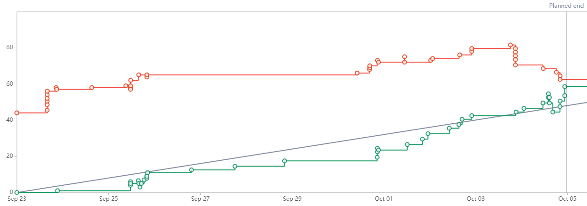

# DANDDY 
> A D&D campaign helper.

## Table of Contents
* [Description](#description)
* [GeneralInformation](#general-information)
* [TechnologiesUsed](#technologies-used)
* [Features](#features)
* [Contact](#contact)

<!-- * [License](#license) -->

## Description
- Collaborators : [Contact](#contact)
- Creating a D&D Campaign helper that improves quality of life for campaigns and combat  
- Improve the quality of life and gameflow of DM's and players.
- We are doing this to save some time for players and improve the QoL for players

## General Information 

## Technologies Used
- [React Native](https://reactnative.dev/)
- [Type-Script](https://www.typescriptlang.org/)
- [Cloud Tunnel](https://www.cloudflare.com/products/tunnel/)

## Features
- Device Connectivity:
   - Users should be able to connect to each others device to give an update about combat and etc..  
   - The DM and the players are going to be connected to show the game
- DM Interface
   - DM has a list of players info and character sheets  
   - edit and take notes
- Player Interface
   - Toggle dice roller. Have their own character sheets and status.
   - Players should have their own screen

## Sprint 1

#### Contributions

**Adam**: "Developed a public messaging system and reasearched the best fitting database"  
   >- `Jira Task: Implement UI for Combat Order` 
      - [CP-26](https://cs3398-luna-f24.atlassian.net/browse/CP-26?atlOrigin=eyJpIjoiNzQxNTI2YTZkOTQ3NGE1NDhmODIxYzdjZjc4NDlmMTciLCJwIjoiaiJ9), [Bitbucket Branch](https://bitbucket.org/cs3398-luna-f24/danddy_cs3398project/branch/CP-24-design--implement-ui-for-combat-pa)  
   - `Jira Task: Research AppwWrite BaaS`  
      - [CP-74](https://cs3398-luna-f24.atlassian.net/browse/CP-74), [Bitbucket Branch](https://bitbucket.org/cs3398-luna-f24/danddy_cs3398project/branch/CP-74-research-appwwrite-baas)  
   - `Jira Task: Implement Google Firebase`  
      - [CP-81](https://cs3398-luna-f24.atlassian.net/browse/CP-81), [Bitbucket Branch]()  
   - `Jira Task: Implement DM to Player messaging system`
      - [CP-46](https://cs3398-luna-f24.atlassian.net/browse/CP-46), [Bitbucket Branch](https://bitbucket.org/cs3398-luna-f24/danddy_cs3398project/branch/CP-46-implement-dm-to-player-messaging-system)  

**Joshua**: ""  
   >- `Jira Task: Create Room System for Players and DM`  
      - [CP-83](https://cs3398-luna-f24.atlassian.net/browse/CP-83), [Bitbucket Branch](https://bitbucket.org/cs3398-luna-f24/danddy_cs3398project/branch/CP-83-create-room-system-for-players-and)  
   - `Jira Task: Create base project file structure using Next.js`  
      - [CP-75](https://cs3398-luna-f24.atlassian.net/browse/CP-75), [Bitbucket Branch](https://bitbucket.org/cs3398-luna-f24/danddy_cs3398project/branch/CP-75-create-base-project-file-structure)  
   - `Jira Task: Database Schema Design for Combat Tracking`  
      - [CP-27](https://cs3398-luna-f24.atlassian.net/browse/CP-45), [Bitbucket Branch](https://bitbucket.org/cs3398-luna-f24/danddy_cs3398project/branch/CP-27-database-schema-design-for-combat-)  
   - `Jira Task: Investigate DND API`  
      - [CP-44](https://cs3398-luna-f24.atlassian.net/browse/CP-27), [Bitbucket Branch](https://bitbucket.org/cs3398-luna-f24/danddy_cs3398project/branch/CP-44-investigate-dnd-api)  
   - `Jira Task: Build local multiplayer integration` 
      - [CP-5](https://cs3398-luna-f24.atlassian.net/browse/CP-5), [Bitbucket Branch](https://bitbucket.org/cs3398-luna-f24/danddy_cs3398project/branch/CP-5-build-local-multiplayer-integration)  

**Olivia**: ""  
   >- `Jira Task: Implement Player UI`  
      - [CP-82](https://cs3398-luna-f24.atlassian.net/browse/CP-82), [Bitbucket Branch](https://bitbucket.org/cs3398-luna-f24/danddy_cs3398project/branch/CP-82-implement-player-ui)  
   - `Jira Task: Implement DM interface`  
      - [CP-77](https://cs3398-luna-f24.atlassian.net/browse/CP-77), [Bitbucket Branch](https://bitbucket.org/cs3398-luna-f24/danddy_cs3398project/branch/CP-77-implement-dm-interface)  
   - `Jira Task: Design/ Implement UI for Combat Page`  
      - [CP-24](https://cs3398-luna-f24.atlassian.net/browse/CP-24), [Bitbucket Branch](https://bitbucket.org/cs3398-luna-f24/danddy_cs3398project/branch/CP-24-design--implement-ui-for-combat-pa)  
   - `Jira Task:  Design Player Management UI`  
      - [CP-18](https://cs3398-luna-f24.atlassian.net/browse/CP-18), [Bitbucket Branch](https://bitbucket.org/cs3398-luna-f24/danddy_cs3398project/branch/CP-18-design-player-ui)  
   - `Jira Task: Creating Components for DM Home and Character Sheets`  
      - [CP-8](https://cs3398-luna-f24.atlassian.net/browse/CP-8), [Bitbucket Branch](https://bitbucket.org/cs3398-luna-f24/danddy_cs3398project/branch/CP-8-implement-dm-pages-charsheets-npc-e)  
   - `Jira Task: Design DM interface`  
      - [CP-7](https://cs3398-luna-f24.atlassian.net/browse/CP-7), [Bitbucket Branch](https://bitbucket.org/cs3398-luna-f24/danddy_cs3398project/branch/CP-7-design-dm-interface)  

**Roman**: "Designed and integrated database and authentication through Firebase"  
   >- `Jira Task: Design Database Schema`  
      - [CP-36](https://cs3398-luna-f24.atlassian.net/browse/CP-36), [Bitbucket Branch](https://bitbucket.org/cs3398-luna-f24/danddy_cs3398project/branch/CP-36-design-database-schema)  
   - `Jira Task: Implement Initial Structure of the Database`  
      - [CP-78](https://cs3398-luna-f24.atlassian.net/browse/CP-78), [Bitbucket Branch](https://bitbucket.org/cs3398-luna-f24/danddy_cs3398project/branch/feature/CP-78-implement-initial-structure-of-the)  
   - `Jira Task: Implement Authentication for User Data Secuirty`  
      - [CP-39](https://cs3398-luna-f24.atlassian.net/browse/CP-39), [Bitbucket Branch](https://bitbucket.org/cs3398-luna-f24/danddy_cs3398project/branch/CP-39-implement-authentication)  
   - `Jira Task: Implement Backend API to Connect to Cloud Database`  
      - [CP-37](https://cs3398-luna-f24.atlassian.net/browse/CP-37), [Bitbucket Branch](https://bitbucket.org/cs3398-luna-f24/danddy_cs3398project/branch/CP-37-implement-backend-api)  

**Lorenz**: "Designed,implemented and integrated Homescreen,Character Page, and Login Page (Front-end)"  
   >- `Jira Task: Design home screen`  
      - [CP-3](https://cs3398-luna-f24.atlassian.net/browse/CP-3)  
      - [Bitbucket Branch](https://bitbucket.org/cs3398-luna-f24/danddy_cs3398project/branch/CP-3-design-home-screen)  
   - `Jira Task: Track Player data in database`  
      - [CP-43](https://cs3398-luna-f24.atlassian.net/browse/CP-43)  
      - [Bitbucket Branch](https://bitbucket.org/cs3398-luna-f24/danddy_cs3398project/branch/CP-43-track-player-data-in-database)  
   - `Jira Task: Use 5ednd API to create a test and mockup for the API`  
      - [CP-51](https://cs3398-luna-f24.atlassian.net/browse/CP-51)  
      - [Bitbucket Branch](https://bitbucket.org/cs3398-luna-f24/danddy_cs3398project/branch/CP-51-use-an-api-that-has-dd-related-con)  
   - `Jira Task: Implement Player List Component`  
      - [CP-19](https://cs3398-luna-f24.atlassian.net/browse/CP-19)  
      - [Bitbucket Branch](https://bitbucket.org/cs3398-luna-f24/danddy_cs3398project/branch/CP-19-implement-player-list-component)  
   - `Jira Task: Implement Home screen design`  
      - [CP-76](https://cs3398-luna-f24.atlassian.net/browse/CP-76)  
      - [Bitbucket Branch](https://bitbucket.org/cs3398-luna-f24/danddy_cs3398project/branch/CP-76-implement-home-screen-design)  

### Reports

#### Next Steps

**Adam**:
   >- Fleshing out the functionality of the messaging system
   >- Setting up basic tutorial structure
**Joshua**:
   >- Work on player syncronization with the front end and database
   >- Setting up combat backend functionality 
**Olivia**:
   >- Make the front end look better
   >- Make the front end functional for player and DM
   >- Assist in making the combat page
**Roman**:
   >- Working on user authentication and tying user data
   >- Getting the DM syncronization with the front end and database
**Lorenz**:
   >- Data pulling for the players and characters
   >- Assisting in desiging front end
   >- Making the combat page
   
## Contact
Adam Long  
Joshua Mason  
Olivia Laurel  
Roman Merlick  
Lorenz De Robles  

<!-- Optional -->
<!-- ## License -->
<!-- This project is open source and available under the [... License](). -->

<!-- You don't have to include all sections - just the one's relevant to your project -->
